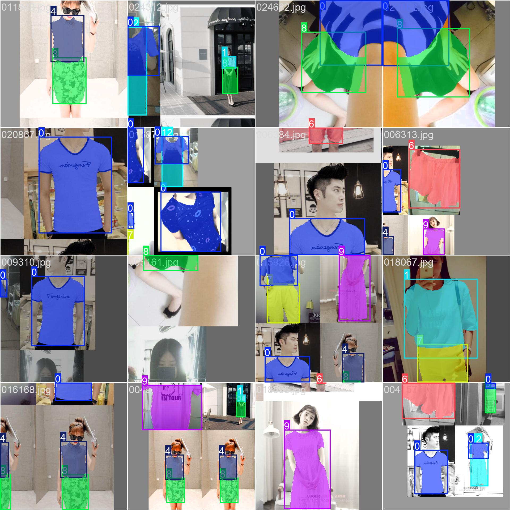
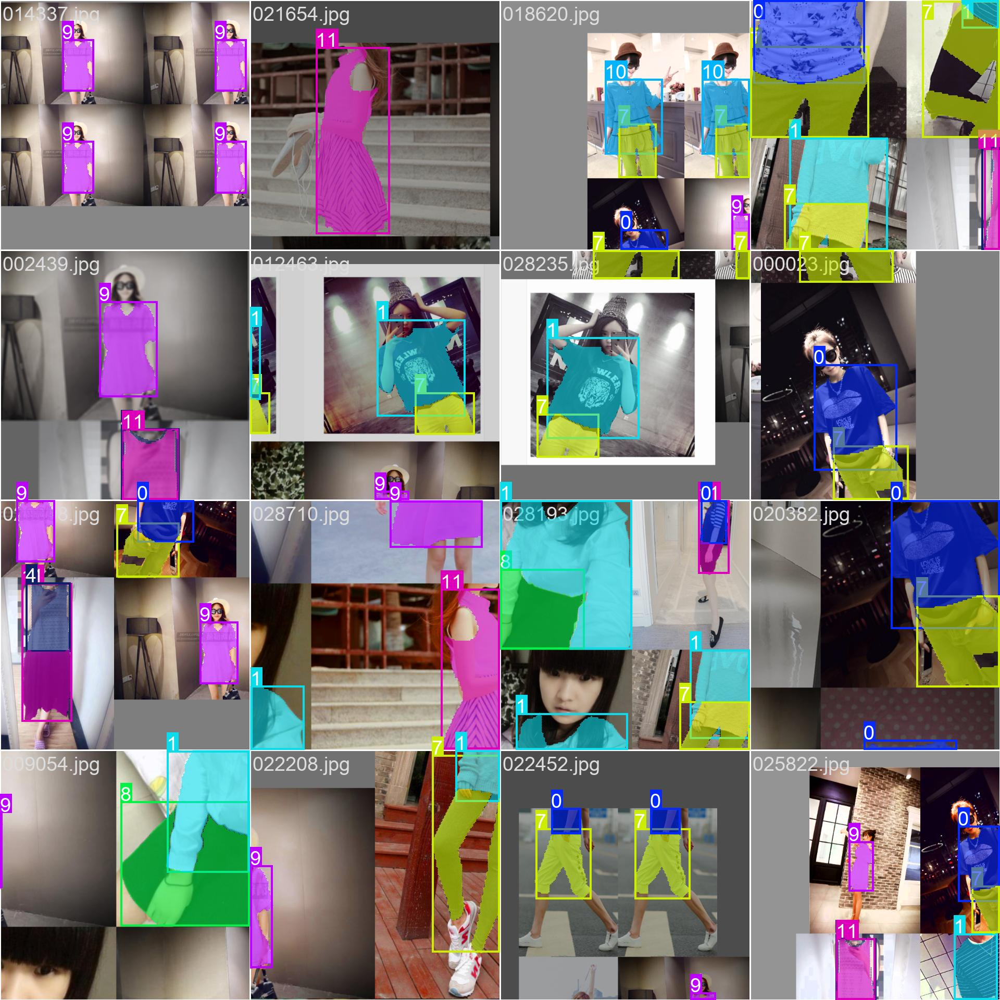
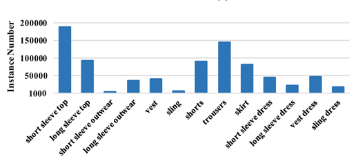
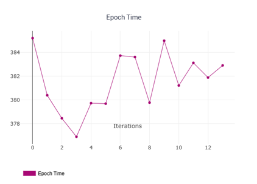
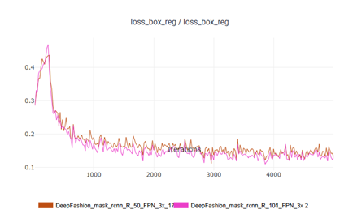
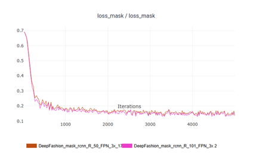
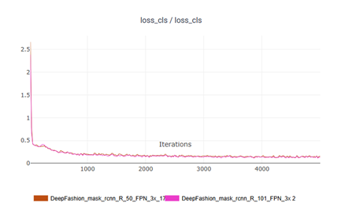

# Clothing Detection and Segmentation

## Team

| Name                   | Innomail                          |
| ---------------------- | --------------------------------- |
| Apollinaria Chernikova | a.chernikova@innopolis.university |
| Egor Machnev           | e.machnev@innopolis.university    |

## Repository

https://github.com/ApollyCh/cloth-detection

## Artifacts

[Experiments](https://github.com/ApollyCh/cloth-detection/tree/main/experiments)

[Evaluation](https://github.com/ApollyCh/cloth-detection/tree/main/evaluation)

[DeepFashion2 Dataset](https://github.com/switchablenorms/DeepFashion2)

[Models Weights](https://github.com/ApollyCh/cloth-detection/releases/tag/v1.0)

## Project topic

The aim of this project is to develop a computer vision system capable of
detecting and segmenting various types of clothing items in images. The system
will focus on two main tasks:

Clothing Classification: Identifying and categorizing of clothing types (e.g.,
shirts, pants, dresses). Clothing Segmentation: Accurately separating clothing
items from the image background for enhanced detection and identification in
different environments.

## Methodology

### A. Dataset

For this study, we utilized the DeepFashion2 dataset [1], one of the most
comprehensive datasets for clothing detection and segmentation. The dataset
contains 191K images for training and 32K images for validation. Each image is
labeled with bounding boxes, segmentation masks, and clothing attributes. The
dataset includes clothing across 13 main categories and covers a wide range of
scenarios, including occluded items, varying poses, and diverse lighting
conditions.

### B. Model Architectures

Given the dual objectives of detection and segmentation, we chose a combination
of the Mask R-CNN and YOLOv8 architectures. The choice of these architectures
was based on their strengths in addressing the specific requirements of this
study.

Mask R-CNN [2] was chosen for its well-established capabilities in instance
segmentation, particularly its ability to generate accurate pixel-wise
segmentation masks. With its region proposal network (RPN) and Feature Pyramid
Network ( FPN), Mask R-CNN effectively handles multi-scale detection and
segmentation tasks. This model was ideal for achieving high accuracy in
segmentation, especially in scenarios where detailed masks were required to
differentiate overlapping or occluded clothing items.

YOLOv8 [3], on the other hand, was selected for its efficiency in detection and
its ability to operate in real-time scenarios. Unlike Mask R-CNN, YOLOv8
emphasizes speed and computational efficiency while maintaining reasonable
accuracy. Although primarily a detection model, the segmentation extension of
YOLOv8 allowed for basic segmentation capabilities, which were leveraged in this
study to compare its performance with Mask R-CNN. YOLOv8's lightweight nature
made it a suitable candidate for applications where processing speed was
critical.

Both models were fine-tuned using pre-trained weights to expedite the training
process and improve performance. Specifically, the Detectron2 [4] framework was
used for training the Mask R-CNN model. Detectron2 is a highly efficient
implementation of several state-of-the-art object detection algorithms,
including Mask R-CNN, and is built on top of PyTorch. The pre-trained weights
for Detectron2 were obtained from a model trained on large-scale datasets like
COCO, which significantly accelerated convergence during training and improved
model performance on the DeepFashion2 dataset.

Similarly, YOLOv8 was initialized with pre-trained weights, leveraging a model
trained on large object detection datasets like COCO to enhance learning on
fashion-specific tasks. Fine-tuning these models on the DeepFashion2 dataset
enabled them to adapt to the nuances of clothing detection and segmentation.

### C. Hardware Resources

All training experiments were conducted using the maximum computational
resources available to us. The primary hardware used was the NVIDIA Tesla P100
GPU, which offers 16 GB of GPU memory and 30 GB of system memory (RAM).

## Experiments and Evaluation

### A. Training Pipeline

For the training process, we selected three different model configurations: Mask
R-CNN ResNet-50 3x, Mask R-CNN ResNet-101 3x, and YOLOv8n for segmentation
tasks. Given the complex nature of clothing detection and segmentation, we
performed multiple runs with varying hyperparameters for the Mask R-CNN models
to identify the optimal configuration. The parameters for these models were
chosen particularly from the DeepFashion2 dataset findings, and the
computational resources available to us.

---

#### Mask-RCNN Training Parameters

| Hyperparameters              | Values |
| ---------------------------- | ------ |
| Base Learning Rate (LR)      | 0.002  |
| Number of Iterations         | 5000   |
| Number of Warm-up Iterations | 500    |
| Gamma                        | 0.1    |
| Images per Batch             | 8      |
| Batch Size per Image         | 256    |

---

For the Mask R-CNN models, we experimented with ResNet-50 and ResNet-101
backbones. The ResNet-50 model was used for its relatively lower computational
cost and quicker training time, while ResNet-101 was chosen for its deeper
architecture, offering potential improvements in segmentation accuracy,
especially for fine-grained details in clothing items.

In the context of our experiments, we initially planned to train the YOLO model
in addition to Mask R-CNN models. However, due to the limited computational
resources available and the large size of the DeepFashion2 dataset, training
YOLO proved to be impractical. The training process for YOLO was excessively
slow and took an unreasonably long time to complete. This raised concerns about
the feasibility of using YOLO for such large datasets, particularly in a
real-world scenario where fast training and inference are required.

Hence, given the constraints, we made the decision to shift our focus entirely
to the Mask R-CNN architectures. This decision allowed us to dedicate
computational resources more effectively to the Mask R-CNN models, which
demonstrated good performance and faster convergence compared to YOLO under the
given circumstances.

### B. Evaluation Pipeline

For the evaluation of the models, we used metrics that are widely accepted in
the field of instance segmentation to assess the performance of the trained
models. Specifically, we focused on Average Precision (AP) and Average Recall
(AR) as our primary evaluation metrics. These metrics provide a clear and
interpretable measure of a model's effectiveness in detecting and segmenting
individual objects.

## Results Analysis

During the experiments, both models—Mask R-CNN ResNet-50 and Mask R-CNN
ResNet-101—demonstrated strong performance. The total loss decreased
significantly in the initial epochs and continued to improve steadily throughout
training. This indicates that both models were effectively learning from the
dataset and converging towards optimal performance.

The primary difference observed between the two architectures was the training
speed. Due to its smaller number of layers, the ResNet-50 backbone trained
faster than the ResNet-101 backbone. This made ResNet-50 more
resource-efficient, which could be advantageous in scenarios where computational
resources or training time are limited.

As previously mentioned, AP and AR were the primary metrics used to evaluate the
models. Additionally, we evaluated AP for individual classes to examine the
performance of the models across the various categories in the DeepFashion2
dataset. This analysis was crucial because the dataset is inherently unbalanced,
with some classes being underrepresented due to the uneven stratification of
clothing categories. This class imbalance can introduce bias into the model's
predictions, with the risk of overfitting to dominant classes while
underperformed on less frequent ones.

---

#### Model Performance Overview

| Models                 | AP    | AP50  | AP75  | AR    |
| ---------------------- | ----- | ----- | ----- | ----- |
| mask-rcnn-r-50-fpn-3x  | 0.412 | 0.559 | 0.481 | 0.648 |
| mask-rcnn-r-101-fpn-3x | 0.434 | 0.582 | 0.507 | 0.656 |

---

#### Category-wise Performance (AP)

| Category             | r-50  | r-101 | Category           | r-50  | r-101 | Category              | r-50  | r-101 |
| -------------------- | ----- | ----- | ------------------ | ----- | ----- | --------------------- | ----- | ----- |
| Short sleeved shirt  | 0.700 | 0.708 | Long sleeved shirt | 0.564 | 0.596 | Short sleeved outwear | 0.000 | 0.020 |
| Long sleeved outwear | 0.340 | 0.377 | Vest               | 0.433 | 0.434 | Sling                 | 0.030 | 0.030 |
| Shorts               | 0.528 | 0.532 | Trousers           | 0.646 | 0.668 | Skirt                 | 0.562 | 0.578 |
| Short sleeved dress  | 0.478 | 0.499 | Long sleeved dress | 0.310 | 0.355 | Vest dress            | 0.499 | 0.532 |
| Sling dress          | 0.266 | 0.297 |                    |       |       |                       |       |       |

---

#### Mask-RCNN-R-50-FPN

#### Mask-RCNN-R-101-FPN

---

Analyzing the evaluation metrics, it is evident that the Mask R-CNN ResNet-101
model outperforms the ResNet-50 model. This outcome aligns with our initial
expectations, as the deeper architecture of ResNet-101 allows it to learn more
complex patterns and features from the data. However, the improvement is
marginal, with ResNet-101 achieving slightly higher values for AP and AR metrics
compared to ResNet-50. When examining the results across categories, noticeable
differences between the two models become apparent. As shown in the images in
Appendix, ResNet-101 produces more precise segmentation boundaries. The model is
better at accurately delineating the edges of clothing items, even in cases
where occlusions or overlaps are present. In contrast, ResNet-50 occasionally
struggles with defining clear boundaries, particularly in complex scenes with
multiple overlapping garments.

## References

[1] Yuying Ge and Ruimao Zhang and Lingyun Wu and Xiaogang Wang and Xiaoou Tang
and Ping Luo , DeepFashion2: A Versatile Benchmark for Detection, Pose
Estimation, Segmentation and Re-Identification of Clothing Images, 2019,
https://arxiv.org/abs/1901.07973

[2] Kaiming He and Georgia Gkioxari and Piotr Dollár and Ross Girshick, Mask
R-CNN, 2018, https://arxiv.org/abs/1703.06870

[3] R. Varghese and S. M., "YOLOv8: A Novel Object Detection Algorithm with
Enhanced Performance and Robustness," 2024 International Conference on Advances
in Data Engineering and Intelligent Computing Systems (ADICS), Chennai, India,
2024, pp. 1-6, doi: 10.1109/ADICS58448.2024.10533619

[4] https://github.com/facebookresearch/detectron2
